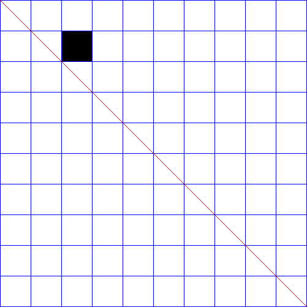

Create an RGB [image](https://docs.rs/image/0.23.14/image/type.RgbImage.html)
out of a 2D [ndarray](https://docs.rs/ndarray/0.15.4/ndarray/index.html) matrix.

Anything larger than 0 (>= 1) is  black and 0 is represented by white

Currently using a matrix u8 but no reason to limit it to u8.

For example, to generate the below 500x500 image
(in actuality a 501x501 image) out of a 10x10 matrix.



```
let config = Config {
		verbosity: 0,
		annotate_image: true,
		draw_diagonal: true,
		draw_boundaries: true,
		scaling_factor: 50,
};

let mut matrix = Array2::<u8>::zeros((10, 10));
matrix[[0,1]] = 1;

// |----------|---|---|-----|----------|
// |          | 0 | 1 | ... | 9 or     |
// |          |   |   |     | j_max or |
// |          |   |   |     | x_max    |
// |----------|---|---|-----|----------|
// | 0        | 0 | 1 | ... | 0        |
// |----------|---|---|-----|----------|
// | 1        | 0 | 0 | ... | 0        |
// |----------|---|---|-----|----------|
// | .        | . | . | .   | .        |
// | .        | . | . |  .  | .        |
// | .        | . | . |   . | .        |
// |----------|---|---|-----|----------|
// | 9 or     |   |   |     |          |
// | i_max or | 0 | 0 | ... | 0        |
// | y_max    |   |   |     |          |
// |----------|---|---|-----|----------|


let scaled_matrix = scale_matrix(&matrix, &config);
let image_name = "image.png";
assert_eq!(generate_image(&scaled_matrix, &config, image_name).unwrap(), ());
```


